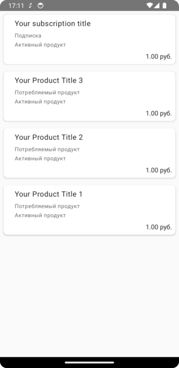
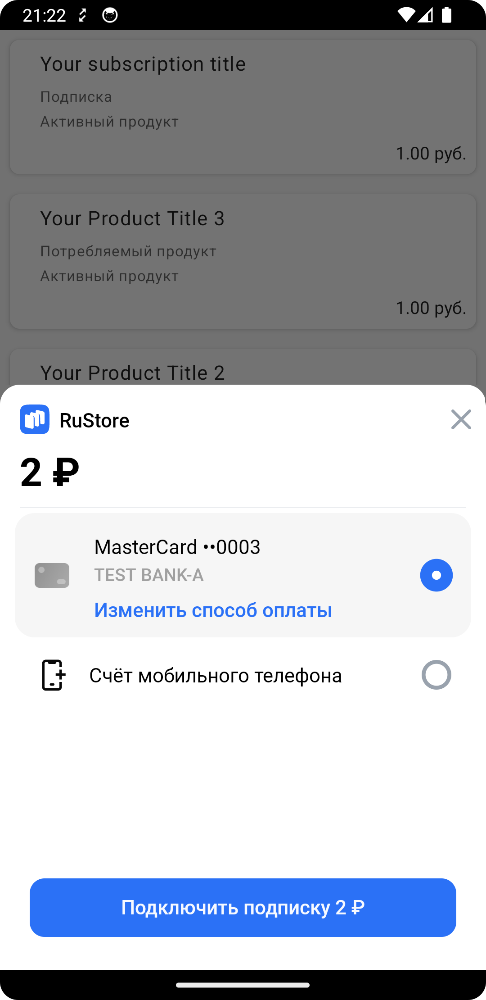

# RuStore SDK Billing implementation example
## [SDK Billing documentation](https://www.rustore.ru/help/en/sdk/payments/kotlin-java/)

### Table of contents
- [Prerequisites](#Prerequisites)
- [Required parameters](#Required-parameters)
- [Configure example app](#Configure-example-app)
- [Use scenario](#Use-scenario)
- [Deeplink handling](#Deeplink-handling)
- [Distribution terms](#Distribution-terms)
- [Technical support](#Technical-support)


### Prerequisites
For in-app payments to work, the following requirements must be met.

1. Your app user must be authorized on the RuStore.

2. The user and the app are not banned in RuStore.

3. In-app purchases for the app are enabled in [RuStore Console](https://console.rustore.ru/sign-in).

> The service has some restrictions to work outside of Russia.


### Required parameters
To correctly configure the example app, you need to have the following parameters:

1. `consoleApplicationId` - application code from RuStore Console (example: https://console.rustore.ru/apps/123456), in our example `consoleApplicationId` = 123456

2. `applicationId` - value from the app you published in the RuStore Console, it is in the build.gradle of your project

   ```
    android {
       defaultConfig {
       applicationId = "ru.rustore.sdk.billingexample"
       }
    }
   ```

3. `availableProductIds` - [subscriptions](https://www.rustore.ru/help/en/developers/monetization/create-app-subscription/) and [single purchases ](https://www.rustore.ru/help/en/developers/monetization/create-paid-product-in-application/) available in your app

4. `release.keystore` - signature that was used to sign your app in the RuStore Console.

5. `release.properties` - this file must contain the parameters of the signature that was used to sign your app published in the RuStore Console. [Working with signature keys for APK files](https://www.rustore.ru/help/en/developers/publishing-and-verifying-apps/app-publication/apk-signature/)


### Configure example app
To test your app, you can use our [sandbox](https://www.rustore.ru/help/en/developers/monetization/sandbox).

1. Specify `consoleApplicationId` of your app in `RuStoreBillingClientFactory.create()`:

   ```
   val billingClient = RuStoreBillingClientFactory.create(
       context = context,
       consoleApplicationId = "111111", // Replace with your id (https://console.rustore.ru/apps/111111)
   )
   ```

2. Replace `applicationId` in build.gradle, with applicationId of the APK file that you published in the RuStore Console:

   ```
   android {
       defaultConfig {
          applicationId = "ru.rustore.sdk.billingexample" // .debug is often specified in buildTypes
       }
   }
   ```

3. In the `cert` folder replace the `release.keystore` certificate with the certificate of your app, also, in `release.properties` configure parameters `key_alias`, `key_password`, and `store_password`.  The `release.keystore` signature must match the signature tha was used to sign the app published in the RuStore Console. Make sure that `buildType` used (example: debug) uses the same signature as the published app (example: release).

4. In the `availableProductIds` variable of `BillingExampleViewModel`, list subscriptions and consumable products available in your app:

   ```
   private val availableProductIds = listOf(
       "productId1",
       "productId2",
       "productId3"
   )
   ```

5. Run your project and test your app performance


### Use scenario

#### Payments availability check
Pressing the "Start purchases" button triggers the [payment availability check](https://www.rustore.ru/help/en/sdk/payments/kotlin-java/6-0-0#checkpurchasesavailability),


#### Retrieving products list
Opening the `BillingExampleFragment` screen triggers retrieving and displaying the [products list](https://www.rustore.ru/help/en/sdk/payments/kotlin-java/6-0-0#getproducts)




#### Product purchase
Pressing the item triggers the [product purchase](https://www.rustore.ru/help/en/sdk/payments/kotlin-java/6-0-0#purchaseproduct) scenario with the payment method screen display.
Then, if PaymentResult.Success -> is returned, [purchase confirmation](https://www.rustore.ru/help/en/sdk/payments/kotlin-java/6-0-0/#confirmpurchase) is triggered, otherwise, if PaymentResult.Failure -> is returned, [purchase cancellation](https://www.rustore.ru/help/en/sdk/payments/kotlin-java/6-0-0/#deletepurchase) is triggered.





### Deeplink handling
This section does not apply to the example app configuration. It contains the information on how to correctly configure `deeplink` in your app.

`deeplinkScheme` — a deeplink scheme required to return the user to your app after making a payment in a third-party app (for example: in SberPay or SBP). SDK generates its host for this scheme.

To redirect a user to your app after payment via third-party apps (the Faster Payments System (SBP), SberPay and others), you need to properly implement deep linking in your app. To achieve this, specify intent-filter with the scheme of your project in `AndroidManifest.xml`.

1. In the data android:scheme parameter of your `AndroidManifest.xml` file specify the deeplink URL address (it must match `deeplinkScheme` from item 1)

   ```
   <activity
   android:name=".MainActivity">

       <intent-filter>
          <action android:name="android.intent.action.VIEW" />
          <data android:scheme="rustoresdkexamplescheme" /> // Replace with your deeplink
       </intent-filter>

   </activity>
   ```

2. Specify `deeplinkScheme` of your app in `RuStoreBillingClientFactory.create()`:

   ```
   val billingClient = RuStoreBillingClientFactory.create(
       context = context,
       deeplinkScheme = "rustoresdkexamplescheme", // Specify the deeplink URL address. Must match <data android:scheme="" />
   )
   ```

3. Next, add the following code to the Activity you need to return to after making the payment (your store page):

   ```
   class MainActivity: AppCompatActivity() {

       // Previously created with RuStoreBillingClientFactory.create()
       private val billingClient: RuStoreBillingClient = YourDependencyInjection.getBillingClient()

       override fun onCreate(savedInstanceState: Bundle?) {
           super.onCreate(savedInstanceState)
           if (savedInstanceState == null) {
               billingClient.onNewIntent(intent)
           }
       }

       override fun onNewIntent(intent: Intent?) {
           super.onNewIntent(intent)    
           billingClient.onNewIntent(intent)
       }
   }
   ```

4. To restore your app state after returning from deeplink, add android:launchMode="singleTask" to your `AndroidManifest.xml`

   ```
   <activity
      android:name=".MainActivity"
      android:launchMode="singleTask"
      android:exported="true"
      android:screenOrientation="portrait"
      android:windowSoftInputMode="adjustResize">
   ```


### Distribution terms
This software, including its source code, binary libraries, and other files is distributed under the MIT license. The license information is available in the `MIT-LICENSE.txt` document


### Technical support
If you have any questions regarding SDK Billing, please, follow this [link](https://www.rustore.ru/help/en/sdk/payments).
